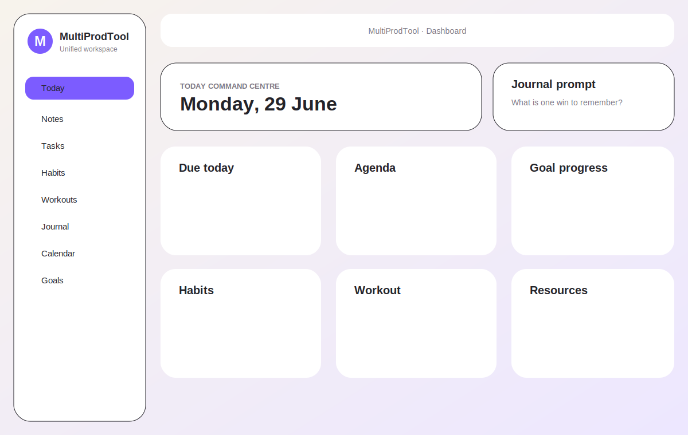
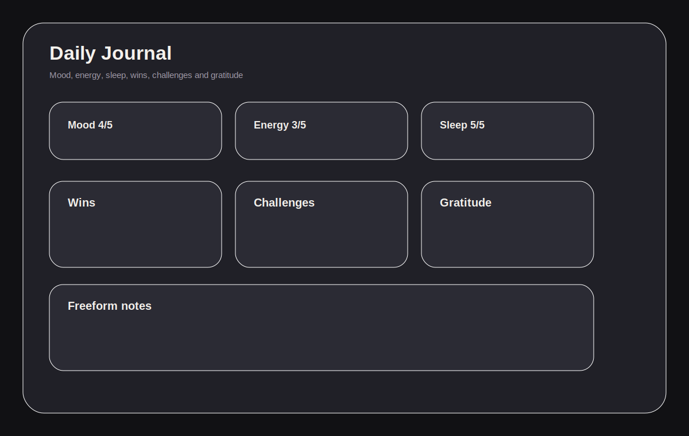
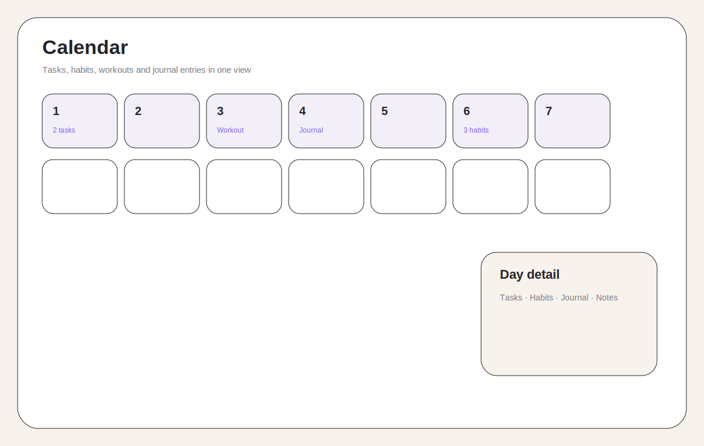

<div align="center">
  

  # MultiProdTool

  **A private, self-hosted personal operating system for planning, reflection, fitness, and knowledge.**

  [](#install-on-zimaos)
  [](#install-on-zimaos)
  [](#data-and-backups)
</div>

---

## Overview

MultiProdTool is a Docker web app designed for private deployment on ZimaOS or another home server. Your data is stored locally on your server in a readable JSON file.

It combines daily planning, notes, tasks, habits, workouts, journaling, calendar, goals, and resources into one polished workspace.

## Screenshots

| Dashboard | Journal | Calendar |
|---|---|---|
|  |  |  |

## Features

| Area | What it does |
|---|---|
| **Dashboard / Today** | Quick capture, agenda, journal prompt, goals, habits, tasks, and recent resources. |
| **Notes** | Markdown-style notes, folders, tags, backlinks, and search. |
| **Tasks** | Projects, due dates, priorities, subtasks, recurrence, detail drawer, and Kanban project view. |
| **Habits** | Habit editor, reminders, streaks, heatmap, and 7/30/90-day analytics. |
| **Workouts** | Routines, exercise library, focused workout mode, rest timer, history, and personal records. |
| **Journal** | Daily mood, energy, sleep, wins, challenges, gratitude, notes, and linked day activity. |
| **Calendar** | Month and agenda views for tasks, habits, workouts, journal entries, and date-linked notes. |
| **Goals** | Outcomes with milestones, progress, and links to notes, tasks, habits, routines, and projects. |
| **Resources** | Lightweight URL/reference library with tags and links to projects, goals, and notes. |
| **Command palette** | Global search and quick actions with `Ctrl/Cmd + K`. |
| **Settings and backups** | Export/import backup, theme/accent settings, save status, and automatic server backups. |

## Install on ZimaOS

The recommended deployment flow is:

```text
GitHub repo → GitHub Actions → GitHub Container Registry → ZimaOS
```

Use this compose configuration in ZimaOS:

```yaml
services:
  multiprodtool:
    image: ghcr.io/karthikgopi1234/multiprodtool:latest
    container_name: multiprodtool
    restart: unless-stopped
    ports:
      - "8787:8787"
    environment:
      - NODE_ENV=production
      # Optional Basic Auth:
      # - MULTIPROD_AUTH_USERNAME=admin
      # - MULTIPROD_AUTH_PASSWORD=change-this-password
    volumes:
      - multiprodtool-data:/data

volumes:
  multiprodtool-data:
```

Open the app at:

```text
http://<zimaos-ip>:8787
```

For the full deployment walkthrough, see [docs/ZIMAOS_GITHUB_DEPLOYMENT.md](docs/ZIMAOS_GITHUB_DEPLOYMENT.md).

## Updating

After pushing changes and waiting for the GitHub Action to finish:

```bash
docker compose pull
docker compose up -d
```

Do **not** delete the `multiprodtool-data` volume unless you intentionally want to erase your data.

## Data and backups

Main data file:

```text
/data/multiprodtool-data.json
```

Automatic backups:

```text
/data/backups
```

The server creates a timestamped backup before replacing the main data file and keeps the most recent 30 automatic backups. Manual export/import is available in **Settings**.

## Privacy and security

MultiProdTool is intended for private self-hosting.

- No telemetry or analytics code is included.
- App persistence uses same-origin `/api/data` requests.
- Data is not intentionally sent to an external service.
- Optional HTTP Basic Auth is available.
- For remote access, use a trusted access layer such as Tailscale, ZeroTier, Cloudflare Access, or a secured reverse proxy.

Further reading:

- [Security self-hosting notes](SECURITY_SELF_HOSTING.md)
- [Latest security audit](SECURITY_AUDIT.md)
- [AI disclosure](AI_DISCLOSURE.md)
- [Product direction](PRODUCT_DIRECTION.md)

## Development

```bash
npm install
npm run typecheck
npm run build
npm audit
npm run start
```

Requirements:

```text
Node >= 22.12.0
npm >= 10.8.0
```

## AI disclosure

This project was fully built using AI-assisted development through **Arena.ai Agent Mode**, guided by human prompts, testing, and review. Arena.ai Agent Mode may use models including, but not limited to, Claude, ChatGPT, Gemini, Grok, Qwen, and Kimi.
